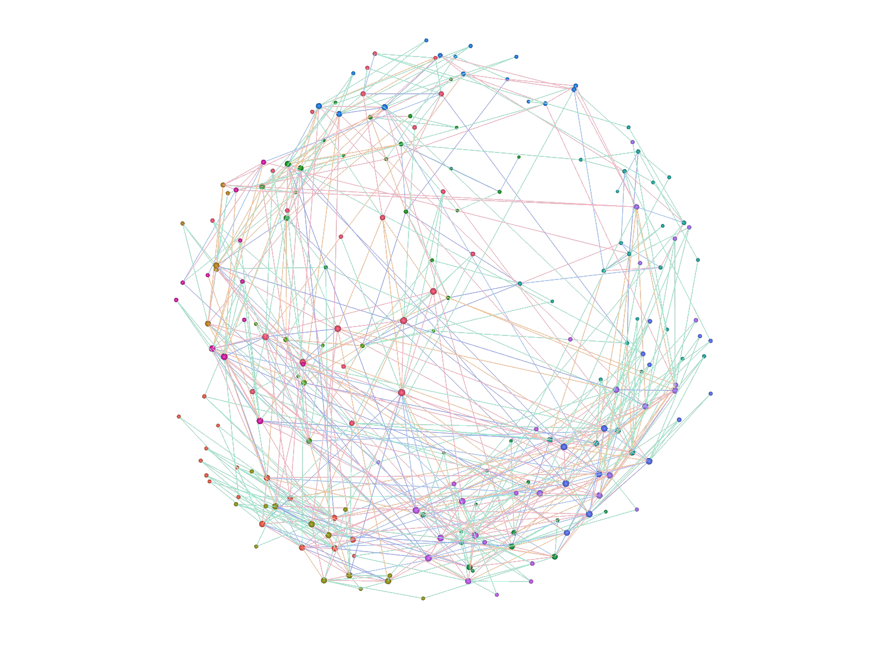
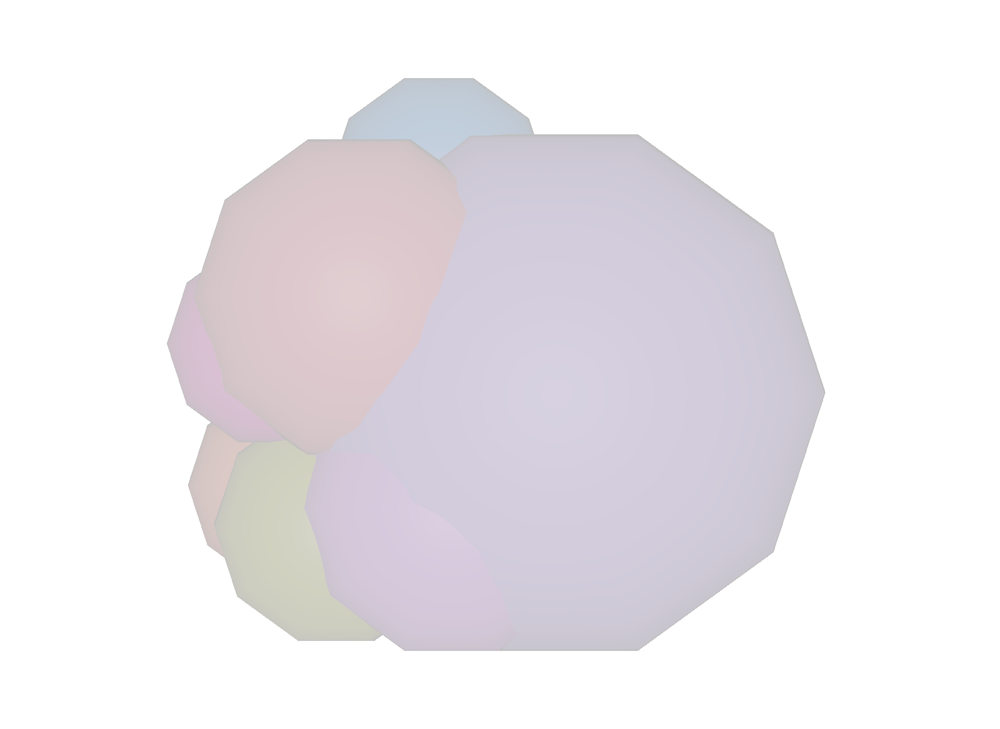
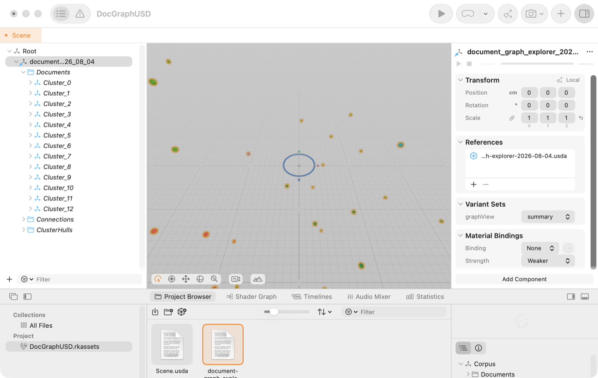

<div align="center">
  
  <h1>Document Graph Explorer</h1>
  <p><strong>A private, local-first 2D/3D knowledge map for documents and source repositories.</strong></p>
  <p>
    Drop in PDFs, Markdown, Office files, HTML, text, or code. Document Graph Explorer finds topics,
    entities, references, and semantic relationships in your browser—then turns the corpus into an
    explorable graph you can search, read, synchronize, compare, and export.
  </p>
  <p>
    <a href="https://document-graph-explorer.vercel.app"><strong>Try the live app</strong></a>
    · <a href="docs/user-guide.md">Read the user guide</a>
    · <a href="https://github.com/chrisatom1998/document-graph-explorer/releases/latest">Download a release</a>
    · <a href="SECURITY.md">Review the security model</a>
  </p>
  <p>
    <a href="https://github.com/chrisatom1998/document-graph-explorer/actions/workflows/ci.yml"></a>
    <a href="https://github.com/chrisatom1998/document-graph-explorer/releases/latest"></a>
    <a href="LICENSE"></a>
    <a href="package.json"></a>
    <a href="SECURITY.md"></a>
  </p>
</div>

> [!IMPORTANT]
> **Your documents stay on your device by default.** Parsing, OCR, embeddings, similarity, clustering, search, and rendering run client-side. OpenRouter is an explicit opt-in cloud provider; Ollama runs against your own local server. For environments that require an enforced guarantee rather than a toggle, `npm run build:airgap` produces a build whose browser policy permits no external hosts. See [SECURITY.md](SECURITY.md) for the exact data-flow contract.

## From folder to knowledge map

1. **Ingest.** Drop files or a whole folder, choose **Add a folder**, connect a watched folder, or load the built-in demo corpus.
2. **Understand.** The browser pipeline parses the content, extracts topics and entities, creates local BGE embeddings, builds evidence-backed relationships, and groups the result with Louvain community detection. Heavy stages run in workers; PDF.js text extraction remains client-side on the main thread.
3. **Explore.** Navigate the graph in 2D or 3D, open the full reader, search passages, inspect why documents are connected, compare snapshots, annotate findings, and optionally ask an OpenRouter or Ollama model questions.

The product loop is intentionally simple: **drop files → explore the graph → read and search**. OpenUSD, collaboration, AI enrichment, and packaging are powerful extensions, not prerequisites.

### Measured on the published benchmark setup

| Workload | Result |
| --- | ---: |
| 100 real PDF documents → 202 nodes, 850 edges, 13 clusters | **9.2 s** end to end, about **11 docs/s** |
| 2,000-node / 8,400-edge force layout | **5.93 s** to settle |
| Settled 2,000-node / 8,400-edge scene | **119.8 FPS**, capped by the 120 Hz display |

These numbers are one calibrated data point from an Apple M5 Max with 36 GB RAM—not a promise for every machine. Ingest and rendering were measured in the Chromium-based embedded browser; the layout benchmark drives the production worker protocol under Node/V8. The full methodology, caveats, layout sweep, and OpenUSD export timings are in [docs/benchmarks.md](docs/benchmarks.md).

## What it can do

| Capability | What you get |
| --- | --- |
| **Local semantic graph** | Self-hosted `bge-small-en-v1.5` embeddings, lexical signals, references, entities, and Louvain communities—all computed client-side without an account or backend. |
| **Broad document ingestion** | Markdown, HTML, text, PDF, DOCX, PPTX, XLSX, EPUB, RTF, OpenDocument formats, YAML, CSV, notebooks, and many source-code formats. Scanned PDFs fall back to bundled Tesseract OCR; English is included, with extra language packs and the page cap configurable in Settings. |
| **Repository understanding** | Drop a source tree, honor `.gitignore`, skip generated/vendor directories, extract symbols, and turn relative imports/includes into high-confidence graph edges. |
| **Search and reading** | Semantic search, passage highlighting, full document readers, connection evidence, paths between documents, cluster insights, and optional document Q&A. |
| **Live workspaces** | Create multiple named corpora, persist them in IndexedDB, and connect a watched folder so additions, edits, and deletions stay synchronized while the app is open. |
| **Notes and change tracking** | Add notes, tags, and pins; save named snapshots; compare graph versions; report added, removed, and updated documents plus connection churn; and paint changed current documents on the live graph. |
| **Optional AI** | Use OpenRouter with your own key or a local Ollama server for summaries, topics, cluster names, chat, and per-document questions. Core ingestion and graph intelligence require neither. |
| **Share and interchange** | Export sanitized share URLs, JSON, PNG, and composed OpenUSD stages. Share URLs exclude original bytes, full text, paths, embeddings, handles, and settings. |
| **Flexible distribution** | Run as a static web app, local browser app, Electron desktop app, Windows portable app, Linux AppImage, runtime offline mode, or sealed air-gapped build. |

## Quick start

Demo workspaces are saved locally, including notes and tags, and reopen after a reload.

### Try it in the browser

Open the **[live app](https://document-graph-explorer.vercel.app)** and choose **Load demo corpus** to explore immediately, or add your own files. Core processing happens in that browser; adding files does not upload them to Vercel.

### Run it locally

```bash
npm install      # install dependencies
npm run dev      # start the Vite dev server
```

Open the printed local URL, then drag documents onto the window or click **Add a folder** to ingest a directory and its relevant subfolders. Whole source repositories are supported and `.gitignore` rules are honored.

**New here?** The [User Guide](docs/user-guide.md) walks through ingestion, navigation, search, readers, filters, snapshots, annotations, collaboration, AI providers, privacy modes, and exports.

### Use a packaged build

Download the latest published artifacts from [GitHub Releases](https://github.com/chrisatom1998/document-graph-explorer/releases/latest), or build a target yourself using the commands below. Published releases can trail `main`; use the live app or build from the current source tree for the newest unreleased changes. Use `npm run build:airgap` when the distribution must enforce zero external destinations.

## From document pile to digital twin

Document Graph Explorer treats a document collection the way digital-twin tooling treats a physical asset: ingest operational inputs, build a semantic model, keep it synchronized with reality, and make it portable to other tools.

- **Ingest:** parsing, embedding, and linking run entirely client-side. The compute-heavy pipeline is worker-based, while PDF.js text extraction remains on the main thread. A watched folder is the live operational input—the graph tracks the corpus on disk as it changes.
- **Model:** topics, entities, evidence-backed edges, and Louvain communities form a queryable knowledge structure, not just a rendering. Every connection can answer “why are these related?”
- **Synthetic data:** the 100-document demo corpus is 36 committed samples plus 64 records from a synthetic-data generator ([generatedDocuments.ts](src/demo/generatedDocuments.ts)). The generated records are written as real PDFs and pushed through the normal ingest path, with tests pinning every generated cross-reference to a document that exists.
- **Interchange:** the OpenUSD export carries geometry, the `docGraph:` attribute schema, connection evidence, cluster hulls, and composition variants into downstream USD toolchains.
- **Agency:** [usd-agent](tools/usd_pipeline/usd_agent.py) answers natural-language questions by tool-calling over an exported USD scene graph via OpenRouter, local Ollama, or an offline mock provider.
- **Measurement:** [docs/benchmarks.md](docs/benchmarks.md) documents ingest throughput, layout convergence, render frame rate, and export cost with methodology and caveats.

## OpenUSD interoperability

The graph can leave the application as a composed [OpenUSD stage](docs/openusd-pipeline.md), so it remains queryable in `usdview`, NVIDIA Omniverse, Apple Reality Composer Pro, and other USD-aware tools. This is an advanced interoperability path; no NVIDIA hardware is required to validate the exported stage.

| Pixar Storm (`usdrecord`), detailed view | Pixar Storm, `summary` variant | Apple Reality Composer Pro |
| --- | --- | --- |
|  |  |  |

The export is one self-contained text `.usda` file with documents and topic hubs as prims, relationships as curves, cluster hulls, evidence attributes, and a `graphView` variant set that switches between detailed and summary views. Full document text, original bytes, local paths, and embeddings are excluded.

See [docs/product-surface.md](docs/product-surface.md) for the distinction between the core canvas experience and advanced studio, interoperability, and packaging surfaces.

## Using the OpenUSD export

OpenUSD is the scene-description format Pixar built for film and NVIDIA, Apple, and the wider 3D industry adopted. Exporting to it means the graph is no longer trapped in this app: any USD tool can open it, and because the export carries document metadata alongside the geometry, the file stays *queryable*, not just renderable.

**1. Export.** With a corpus loaded, choose **Data → Export OpenUSD scene**. You get one self-contained text file, `document-graph-explorer-<date>.usda`, with no external references. Each document is a sphere sized by connectivity and colored by cluster; each relationship is a curve colored by kind; and every prim carries `docGraph:*` attributes for titles, topics, entities, and connection evidence.

**2. Open it anywhere.** Run `usdview corpus.usda`, drag it into NVIDIA Omniverse USD Composer or Apple Reality Composer Pro, or render it headlessly with `usdrecord`. The stage ships a `graphView` variant set that switches between **detailed** documents/connections and **summary** cluster hulls without editing the export.

**3. Validate and package.** The companion CLI needs Python and one dependency:

```bash
cd tools/usd_pipeline
python3 -m venv .venv && . .venv/bin/activate
pip install -r requirements.txt

python usd_pipeline.py report corpus.usda     # schema + composition check, non-zero exit on violation
python usd_pipeline.py usdz corpus.usda       # package for Omniverse / AR Quick Look
```

`report` is suitable for use as a CI gate on exported assets.

**4. Ask the stage questions.** [usd_agent.py](tools/usd_pipeline/usd_agent.py) is an LLM agent whose tools are read-only USD stage operations, so it answers from the file rather than guessing. Start with the network-free self-test:

```bash
python usd_agent.py selftest corpus.usda
```

Then use OpenRouter or a local Ollama server:

```bash
python usd_agent.py ask corpus.usda "Which cluster has the most documents?"
python usd_agent.py ask corpus.usda "Why are the on-call handoff docs connected?" --provider ollama
python usd_agent.py repl corpus.usda
```

The agent prints its tool calls unless `--quiet` is supplied. `switch_view` changes the selected variant in memory only; it does not write back to the stage.

Common snags: `the 'pxr' module is missing` means the virtual environment is not active or `pip install` has not run; `OPENROUTER_API_KEY is not set` means you need to provide the key or select `--provider ollama`. If `selftest` passes, the stage is valid and any remaining issue is with the model connection.

Full schema tables, validation contracts, and third-party tooling notes are in the [OpenUSD pipeline guide](docs/openusd-pipeline.md).

## Scripts

| Script | What it does |
| --- | --- |
| `npm run dev` | Start the Vite development server with HMR |
| `npm run build` | Type-check, build the production app, verify runtime assets, and enforce the bundle budget |
| `npm run build:airgap` | Build and verify the sealed zero-external-host distribution |
| `npm run typecheck` | Run TypeScript without emitting files |
| `npm test` | Run the Vitest suite once |
| `npm run test:watch` | Run Vitest in watch mode |
| `npm run lint` | Run ESLint across the repository |
| `npm run bench:layout` | Run the layout-convergence benchmark against the production worker |
| `npm run preview` | Preview the production build locally |
| `npm run check:bundle` | Enforce eager-JavaScript limits for normal and air-gapped builds |

## Builds

| Command | Output | Network behavior |
| --- | --- | --- |
| `npm run build` | `dist/` | Fully local by default; optional OpenRouter, local Ollama, or explicitly started collaboration features |
| `npm run build:airgap` | `dist-airgap/` | **Zero external destinations** enforced by CSP, runtime refusal, sanitization, and a post-build verification gate |
| `npm run build:desktop` | `release/mac-arm64/Document Graph Explorer.app`, copied to `/Applications` | Normal app build wrapped as a local macOS desktop executable |
| `npm run dist:mac` | DMG and ZIP under `release/` | Distributable macOS installer images; not notarized by default |
| `npm run dist:win` | Portable Electron executable under `release/` | Distributable Windows desktop build |
| `npm run build:exe` | `release/win/run.exe` plus staged `dist/` | Standalone Windows localhost server and static web build |
| `npm run dist:linux` | AppImage under `release/` | Linux desktop package; not signed |

The production shell lazy-loads the 3D renderer, parsing pipeline, chat, document viewers, settings, and analytics panels. `npm run build` enforces an 80 kB uncompressed entry limit and a 280 kB total eager-JavaScript limit so the heavier scene and ingestion chunks remain demand-loaded.

See [SECURITY.md](SECURITY.md) for the complete privacy guarantee, collaboration disclosures, and verification steps.


## Desktop app

### Build a local macOS application

Run on a Mac:

```bash
npm install
npm run build:desktop
```

This produces `release/mac-arm64/Document Graph Explorer.app` and copies it to `/Applications`, where it appears in Launchpad and Spotlight. This is the local-install path; it does not package an installer for other machines.

### Distributing the app (dmg)

```bash
npm run dist:mac
```

This produces a `Document Graph Explorer-<version>-arm64.dmg` drag-to-Applications installer and a matching ZIP under `release/`. Both targets must be built on macOS.

Distribution caveats:

- **Gatekeeper:** the build is only ad-hoc signed. On another Mac, recipients must right-click → **Open**, or approve it under System Settings → Privacy & Security → **Open Anyway**, the first time. Friction-free distribution requires an Apple Developer ID certificate and notarization.
- **Architecture:** the default output is Apple Silicon (`arm64`) only. Add `--universal` or build a separate `x64` artifact for Intel Macs.

### Run the browser build without development tools

Once you have built the app, launch it without the Vite development server:

1. Run `npm run build` once.
2. Double-click `run.cmd` on Windows or `run.command` on macOS, or run `./run.sh` on Linux.

The launcher starts a dependency-free, localhost-only static server on `127.0.0.1` and opens the app in the default browser. Node.js is the only runtime requirement.

To launch the sealed build, run `npm run build:airgap` once and pass `--airgap` to the launcher: `run.cmd --airgap`, `./run.sh --airgap`, `./run.command --airgap`, or `node scripts/serve.mjs --airgap`.

### Add a Windows desktop shortcut

```bash
npm run install:desktop
```

This adds a **Document Graph Explorer** shortcut that points to `run.cmd` in the repository. No separate application is installed, and the shortcut continues to use updated local builds. To create a shortcut for the sealed build, run:

```powershell
powershell -NoProfile -ExecutionPolicy Bypass -File scripts/install-desktop-shortcut.ps1 -Airgap
```

The icon is generated from `public/icon.svg` into `packaging/document-graph-explorer.ico`; regenerate it with `scripts/make-app-icon.ps1` when the brand icon changes. On macOS, `run.command` can be added to the Dock or turned into an alias after the first Gatekeeper approval.

## How it works

Ingestion is an off-main-thread pipeline:

**parse → boilerplate strip → chunk → tokenize → TF-IDF → embeddings → similarity links → Louvain clustering → topic synthesis**

- **Parsing** ([src/pipeline/parsers/](src/pipeline/parsers/)) handles Markdown, HTML, plain text, PDF link annotations and OCR fallback, Office files, OpenDocument formats, archives such as EPUB, notebooks, and source code. Repository walks honor `.gitignore`, skip generated/vendor trees and lockfiles, and turn relative imports into graph edges.
- **Embeddings** use a self-hosted `bge-small-en-v1.5` model from [public/models/](public/models/) through transformers.js. WebGPU uses FP16 when supported; WASM falls back to the quantized model.
- **Optional AI enrichment** for summaries, topics, cluster names, document Q&A, and chat uses the provider and model selected in Settings: OpenRouter with the user's key or a local Ollama server.
- **The scene** ([src/scene/](src/scene/)) uses React Three Fiber over Three.js with instanced nodes, batched edges, a force-directed layout worker, 2D/3D modes, cluster collapse, and adaptive quality controls.
- **State** lives in Zustand stores under [src/store/](src/store/). Named corpora, graph data, layouts, annotations, snapshots, chat history, settings, original files, embeddings, and watched-folder metadata persist in browser-local IndexedDB according to the active cache settings.
- **Workers and offline behavior** are coordinated by [src/pipeline/coordinator.ts](src/pipeline/coordinator.ts). See [docs/architecture-workers-offline.md](docs/architecture-workers-offline.md) for worker responsibilities and the enforcement differences between runtime offline mode and the air-gapped build.

For the full design, see [knowledge-nebula-spec.md](knowledge-nebula-spec.md), the [product surface guide](docs/product-surface.md), and [docs/](docs/).

## Tech stack

React 19 · React Three Fiber · Three.js · TypeScript 6 · Vite · Zustand · Web Workers · transformers.js · graphology/Louvain · IndexedDB/idb · Yjs/WebRTC · Vitest · Electron.

## Testing

```bash
npm test
```

The suite covers pipeline modules, parsers, graph algorithms, semantic indexing, search and retrieval, import validation and sanitization, persistence, collaboration behavior, scene helpers, UI components, packaging helpers, offline/air-gap safeguards, exports, and the standalone subagent. CI also runs linting, TypeScript, normal and air-gapped builds, bundle-budget enforcement, Windows executable validation, Docker image construction, and a container smoke test.

Browser smoke tests run against the production build: run `npm run build`, then `npx playwright test`. Playwright starts Vite preview automatically. When bundled Chromium is unavailable but Google Chrome is installed, select it with `PLAYWRIGHT_CHANNEL=chrome npx playwright test` on macOS/Linux. In PowerShell, use:

```powershell
$env:PLAYWRIGHT_CHANNEL = 'chrome'
npx playwright test
Remove-Item Env:PLAYWRIGHT_CHANNEL
```

The runner refuses to reuse an occupied port so it cannot silently test another local application. Set `PLAYWRIGHT_PORT` (for example, `4273`) when the default `4173` is in use.

The Chrome override uses the installed browser and native GPU; the default CI Chromium configuration uses software rendering. Browser tests can take several minutes while the local embedding model processes the demo corpus.

## Deployment notes

Production hosting must send the security headers used in Vite development and preview—`X-Frame-Options`, `X-Content-Type-Options`, `Referrer-Policy`, and `Permissions-Policy`—and should send the Content-Security-Policy as a response header. The checked-in Vercel and Docker configurations provide the current production examples; see [vite.config.ts](vite.config.ts), [vercel.json](vercel.json), [DEPLOYMENT.md](DEPLOYMENT.md), and [SECURITY.md](SECURITY.md).

### Audio graphs

Add audio files using Add files or drag and drop. Select a track to play it; use Prepare playback for codecs your browser cannot play directly. The bundled FFmpeg decoder runs on your device in both web and desktop builds, with no upload. Supported extensions include MP3, WAV, FLAC, AIFF, Ogg, Opus, M4A, AAC, WMA, APE, CAF, AMR, and other audio containers. Browser-reported audio MIME types are also accepted. Decoder support varies: encrypted/protected, corrupt, and some specialist codecs cannot be played. Existing limits apply: 64 MB per file and the batch size limit.

Select another audio track and enter a relationship, such as shared sample or similar bassline. Named links appear in the graph, survive subsequent ingestion, and are included in graph exports. Graph exports contain the relationships but do not bundle original audio; add originals again on another device. Automatic links use explicit musical tags in file/folder names when available, then audio estimates: similar tempo, the same or related keys, and likely shared instruments. New audio is analyzed during import; for older tracks, choose **Analyze musical features** in the player. Titles now also create **shared title** relationships from adjacent descriptive phrases, such as “melodic loop” or “bass loop”, before any audio analysis. This works for ordinary document titles too. Case, separators, and simple plurals are normalized; generic words, key tags, and numbers do not create title phrases. Groups of up to seven are fully connected; larger groups use bounded links that keep every member connected. Title links refresh on import, reopening, and title changes. Use the shared-title filter or connection details to inspect them. Audio filenames remain excluded from content-based lexical and semantic linking.

The decoder runtime is staged during dev startup and builds. First-time builds download roughly 190 MB of checksum-verified model weights; later builds reuse verified local files. `npm run setup:music` can prepare these assets before an offline build. Model binaries and private audio samples are not stored in Git. It is loaded for music analysis or Prepare playback.

Music analysis uses Essentia for tempo/key on up to 60 seconds (three excerpts for longer tracks). If a sparse loop does not establish a full key, an audio-only fundamental tracker can report its repeated pitch separately; the audio detector never treats a single pitch as a confirmed key. Separately, explicit file/folder tags such as `Dm`, `D# minor`, `140bpm`, `Dm_140`, `C#3`, or `Synths` supply labeled name clues. For each feature, file tags take precedence over the nearest enclosing folder tags, then audio estimates. User-confirmed instruments retain first priority. The UI and relationship evidence distinguish name clues from audio detections and retain the original audio results for comparison. Generic folders such as `Melodic` or `Bass` do not establish a specific instrument. Folder clues require a supplied relative path (use folder upload); browsers generally omit parent paths for individual files. Instrument detection uses the bundled AudioSet AST model on overlapping 10-second windows across the **whole track**, decoded in bounded batches at the model's native 16 kHz. It retains specific model labels (for example cello and violin separately), removes redundant parent families, and no longer caps the display at eight instruments. The player shows full/partial scan coverage and a **Listen at** button for each detection's strongest passage. Cancellation stops decoding/inference; a model failure preserves partial results with an explicit warning.

Strong single detections (score ≥0.85) or repeated detections (≥0.60 in windows at least five seconds apart) are shown as likely. Weaker supported detections are shown separately as possible and never create instrument links. Overlapping windows are correlated observations, not independent confirmations. These thresholds are conservative heuristics, not calibrated probabilities or a measured accuracy guarantee. Instrument links require the same specific likely label in both tracks; broad families alone do not link a violin to a cello or a trumpet to a trombone. Version 1 scans remain readable and require reanalysis for the new instrument matching rules.

BPM matches allow 3 BPM or 4%, whichever is larger; key matches include identical keys, relative major/minor, and neighboring keys on the circle of fifths. The strongest six neighbors per track/type are retained to limit graph density. Instrument detection is limited to the trained model's vocabulary: it cannot identify every instrument, reliably separate layered mixes, or name sounds absent from its classes. Full-track scans take longer than excerpt scans. These connections do not establish sampling or influence.

Sound identification combines three local models: the ~91 MB **AudioSet AST** instrument detector, the ~21 MB **MTG-Jamendo** music instrument model, and the ~78 MB [music-trained CLAP audio encoder](https://huggingface.co/Xenova/larger_clap_music_and_speech). AST scans the full track; Jamendo and CLAP compare up to three real 10-second excerpts. The display separates **sound source**, **sounds like**, **sound character**, and **suggested role**. For example, a synthesizer may resemble a trumpet while functioning as a sustained pad. Resemblance is not treated as another instrument in the recording.

The ensemble retains strong, specific AST detections. A substantial AST candidate can also take priority when CLAP independently gives it a clear match; otherwise a qualifying Jamendo instrument supplies the estimate. This agreement does not promote weak detections into graph evidence. CLAP compares audio with 41 fixed descriptions for source resemblance, articulation, tone, space and role. Weak or closely tied descriptions remain undetermined. Its instrument resemblances do not independently establish a physical sound source or create instrument links. The model comparison shows attribution, disagreement and incomplete analyses; incompatible model scores are not averaged into a confidence percentage. These are heuristic decisions, not calibrated accuracy guarantees. Models receive audio only; explicit filename/folder hints are handled separately. `npm run setup:music` restores pinned weights; build checks verify weights, configuration and local description-vector checksums. Sources: [Essentia.js](https://github.com/MTG/essentia.js) (AGPL-3.0), [AudioSet AST](https://huggingface.co/Xenova/ast-finetuned-audioset-10-10-0.4593), and [LAION music-and-speech CLAP](https://huggingface.co/laion/larger_clap_music_and_speech) (Apache-2.0).

Choose **Music analysis mode** in Settings or a track's details. **Full** is the default: it shows an early instrument estimate and then verifies the whole track with the existing three-model pipeline. The early estimate is labeled as unfinished and can change during verification. Completed results remain visible during reanalysis. **Fast** still uses all three models, but checks at most three non-overlapping 10-second instrument sections and one music/description excerpt; brief appearances can be missed. Tempo/key analysis is unchanged. The selected mode persists and applies to new imports and reanalysis. Fast results show sampled coverage and can be upgraded by choosing Full and reanalyzing. Files with unknown duration use Full so the end can be discovered safely.

The ensemble runs in the shared web/desktop client without uploading audio or needing an inference server. It downloads/loads its bundled assets on first use. Qwen2-Audio is not included: its published weights are about 16.8 GB and require a separate inference runtime. Identification cannot recover an exact synthesizer preset or establish every instrument hidden in a mix.

Use **Correct the instrument** to confirm a known instrument on one track or all analyzed audio tracks in the current collection. Confirmations replace the displayed model labels and participate in instrument relationships, with their source stated in the edge evidence. They persist through saving, export, and reanalysis. **Use automatic estimates** removes the correction. These are explicit user labels, not model training or a guarantee about future uploads.

The additional **MTG-Jamendo instrument** model uses the official Discogs-EffNet encoder and 40-class classifier (~21 MB combined). It checks up to three real 10-second excerpts at 16 kHz, using Essentia's MusiCNN preprocessing and complete 128-frame patches. The strongest specific instrument at an average score of at least 0.30 becomes an attributed automatic estimate; broad roles such as bass, beat, pad and computer are not converted to instruments. Candidates remain suggestions and do not independently create instrument links. Music-trained CLAP runs alongside it to describe resemblance, character and role. These thresholds are heuristic, not calibrated confidence. Model files and licensing notices are in `public/jamendo-model`; official terms restrict commercial use.

### Audio dependency licenses

Audio dependencies retain their own terms: Essentia.js is AGPL-3.0, FFmpeg core is GPL-2.0-or-later, and the MTG-Jamendo/Discogs models carry noncommercial terms. The app license does not override these model restrictions. Keep the bundled notices and license texts when distributing builds; commercial use of the MTG models requires separate permission. See `public/jamendo-model/NOTICE`, `public/music-model/NOTICE.md`, and `public/sound-model/NOTICE` for model provenance, and the generated `audio-runtime/NOTICE.txt` for decoder source/build references.
