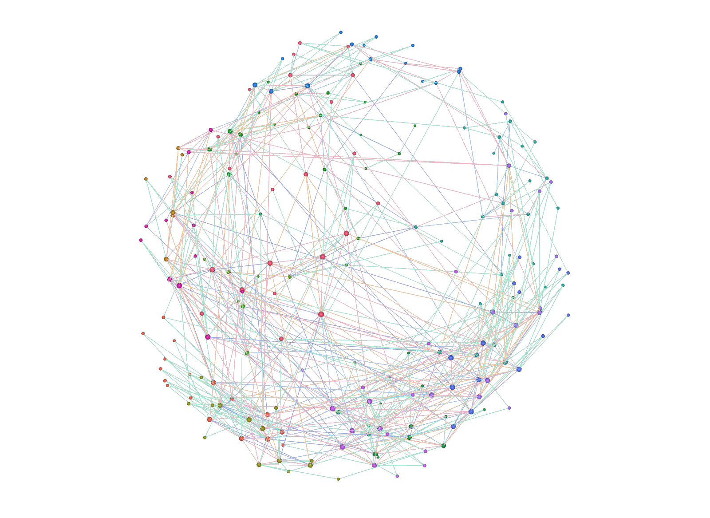
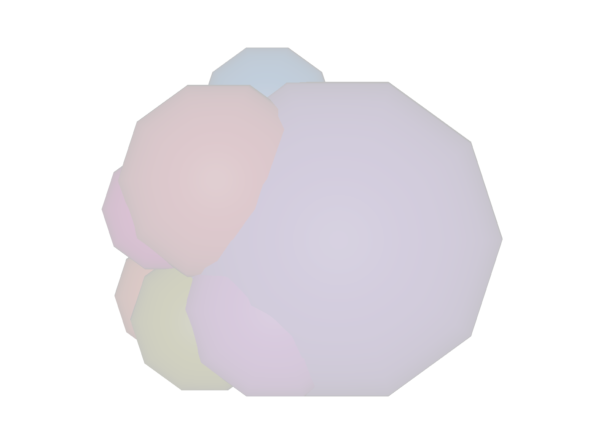
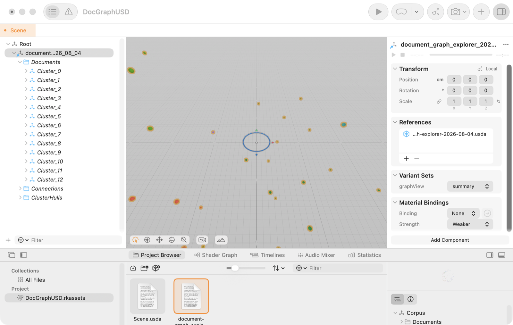

# OpenUSD asset pipeline

Document Graph Explorer can export any corpus as an **OpenUSD stage** — the
scene-description format used by NVIDIA Omniverse, usdview, and the wider
digital-twin ecosystem. The graph you explore in the browser becomes a
composed, queryable 3D asset that downstream tools can open, validate,
re-render, and build on.

| In the app (three.js) | Same corpus in Pixar's Storm renderer (`usdrecord`) |
| --- | --- |
| Force-directed 3D nebula |  |

## Quick start

1. Load a corpus, then **Data → Export OpenUSD scene**. This downloads a
   self-contained `document-graph-explorer-<date>.usda` (text USD, no
   dependencies).
2. Validate and inspect it with the Python pipeline tool:

   ```bash
   cd tools/usd_pipeline
   python3 -m venv .venv && . .venv/bin/activate
   pip install -r requirements.txt
   python usd_pipeline.py report ~/Downloads/document-graph-explorer-*.usda
   ```

   The `report` command opens the stage with Pixar's `usd-core` bindings,
   verifies every schema invariant (see below), exercises the variantSet, and
   exits non-zero on any violation — usable as a CI gate for exported assets.
3. Package for Omniverse / AR Quick Look:

   ```bash
   python usd_pipeline.py usdz corpus.usda -o corpus.usdz
   ```

4. Open it anywhere USD goes: `usdview corpus.usda`, drag into NVIDIA
   Omniverse USD Composer, or render headless with the macOS-bundled tools:

   ```bash
   usdrecord --imageWidth 1600 corpus.usda corpus.png
   usdchecker corpus.usda
   ```

## Stage structure

```
/Corpus                       (Xform, defaultPrim, kind=assembly)
├── variantSet "graphView"    detailed ⇄ summary
├── /Documents
│   └── /Cluster_<n>          (Xform per community, displayName = cluster label)
│       └── /Doc_<id>         (Sphere per document/topic node)
│           ├── xformOp:translate   force-layout position
│           ├── primvars:displayColor  cluster color (OKLab-equalized palette)
│           ├── radius              degree-scaled
│           └── docGraph:*          custom attributes (schema below)
├── /Connections
│   └── /Edges_<kind>         (one BasisCurves per edge kind: reference,
│                              semantic, keyword, entity, topic — colored by
│                              kind, with parallel metadata arrays)
└── /ClusterHulls
    └── /Hull_<n>             (translucent Sphere at each cluster centroid)
```

### The `docGraph` schema

Every prim carries the graph's semantics as namespaced custom attributes, so
the stage is not just geometry — it is a queryable knowledge structure.

| Prim | Attribute | Type | Meaning |
| --- | --- | --- | --- |
| Document sphere | `docGraph:docId` | string | Stable content-hash id |
| | `docGraph:kind` | token | `document` or `topic` |
| | `docGraph:title`, `docGraph:fileType`, `docGraph:status` | string/token | Node identity |
| | `docGraph:topics`, `docGraph:entities`, `docGraph:keywords` | string[] | Extracted semantics |
| | `docGraph:wordCount`, `docGraph:degree` | int | Size and connectivity |
| Cluster Xform / hull | `docGraph:clusterId`, `docGraph:clusterName`, `docGraph:memberCount` | int/string | Community metadata |
| Edge curves | `docGraph:weights`, `docGraph:sourceIds`, `docGraph:targetIds`, `docGraph:evidence` | float[]/string[] | Per-curve parallel arrays — every edge keeps its "why are these connected?" evidence |

### Composition: the `graphView` variantSet

The stage ships two views selected by a variant on `/Corpus`: **detailed**
(document spheres + edge curves) and **summary** (translucent cluster hulls
only). Because it's real USD composition, downstream layers can switch views
without touching the exported file — this 6-line sublayer flips the render:

```usda
#usda 1.0
(
    subLayers = [@./corpus.usda@]
    defaultPrim = "Corpus"
)

over "Corpus" (
    variants = { string graphView = "summary" }
)
{
}
```



## Third-party tooling: Reality Composer Pro

The same stage imports directly into Apple's Reality Composer Pro (Xcode's
USD authoring tool): the full cluster hierarchy appears in the scene tree,
the export shows up as a composition **reference**, and the `graphView`
variantSet surfaces as a native dropdown — switched here to `summary`.



Two RealityKit rendering limits to know about: it does not draw `BasisCurves`
(the edge geometry), and it does not apply visibility opinions authored
inside variants, so the viewport shows document spheres in either variant.
The composition itself — hierarchy, attributes, references, variant
selection — round-trips fully; Storm-based tools (usdview, `usdrecord`,
Omniverse RTX) render everything, as the captures above show. NVIDIA
Omniverse itself requires an RTX GPU (Windows/Linux), so the Omniverse-side
proof here is limited to what its shared OpenUSD/Storm foundations validate.

## Ask the stage: usd-agent

Because the export carries the `docGraph` schema, the stage is not just
renderable — it is answerable. `usd_agent.py` is an LLM agent whose tools are
OpenUSD stage operations (via `usd-core`): it answers natural-language
questions about an exported corpus by querying prims, attributes, and edge
evidence, never by guessing.

```bash
python usd_agent.py ask corpus.usda "Which cluster has the most documents?"
python usd_agent.py ask corpus.usda "Why are the on-call handoff docs connected?"
python usd_agent.py repl corpus.usda            # interactive session
python usd_agent.py selftest corpus.usda        # exercise every tool, no LLM
```

Providers mirror the app's philosophy: `--provider openrouter` (cloud, your
`OPENROUTER_API_KEY`, defaults to Claude Sonnet 5), `--provider ollama`
(local server, zero cloud), or `--provider mock` (no network at all — a
scripted run that exercises the real agent loop, used by `selftest`). Both
live providers speak the OpenAI tool-calling protocol, matching the repo's
Node subagent (`agent/subagentCore.mjs`).

The agent's toolbox: `stage_summary`, `list_clusters`, `find_documents`,
`get_document`, `get_edges`, `get_neighbors`, `top_connected`, plus
`get_view`/`switch_view`, which flip the `graphView` variantSet in memory —
composition as an agent skill. All tools are read-only against the file;
nothing is written back.

## Validation contract

`usd_pipeline.py report` enforces, per stage:

- `defaultPrim` is `/Corpus`; document spheres exist under `/Corpus/Documents`
- every sphere carries the identity attributes; `docGraph:docId` values are unique
- every `Edges_<kind>` prim: all curves are 2-point segments, `points` length
  is exactly `2 × curveVertexCounts`, all four metadata arrays are parallel,
  and every source/target id resolves to an exported document
- the `graphView` variantSet has both variants, and switching them actually
  flips computed visibility (checked via `UsdGeom.Imageable.ComputeVisibility`)

The exported stage also passes stock `usdchecker` in all variant combinations.

## Privacy

The export carries the same envelope as the shareable URL: titles, topics,
entities, keywords, cluster labels, connection evidence, positions, and
colors. It excludes full document text, original file bytes, local paths, and
embeddings.
